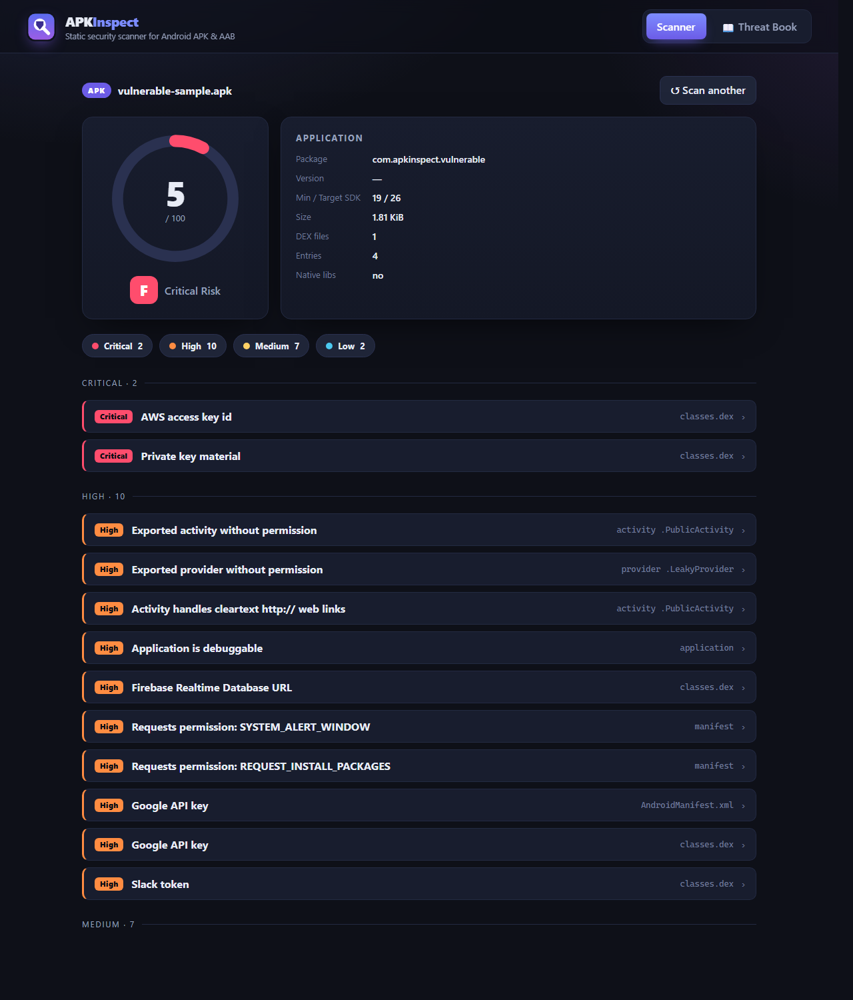
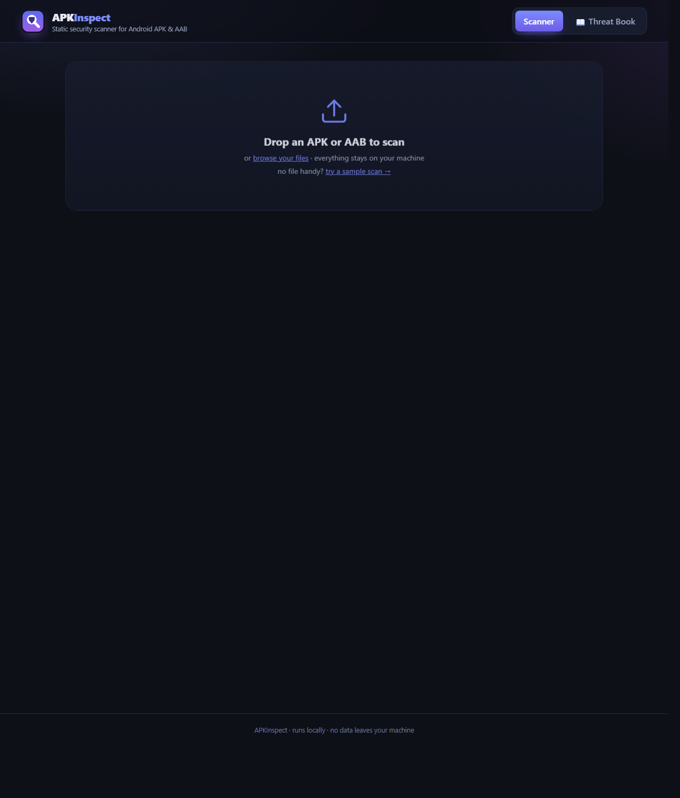
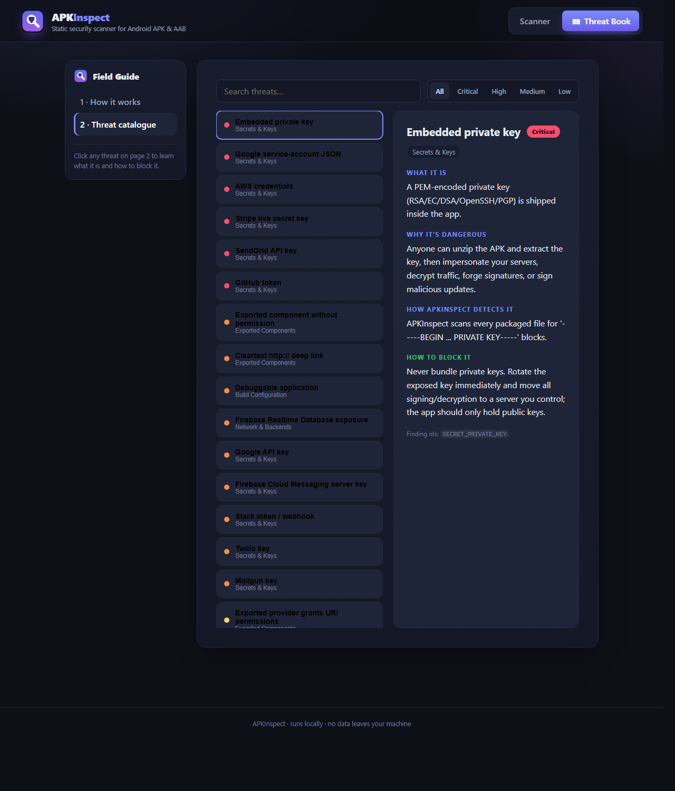

<div align="center">


# APKInspect

**A self-contained static security scanner for Android APK &amp; AAB files.**

Drag in an app → get a safety score from **100 (safe)** to **0 (exposed)**,
with a clear, fix-it-now explanation for every finding.

[](https://github.com/rongo270/APKInspect/actions/workflows/ci.yml)
[](https://www.python.org/downloads/)
[](LICENSE)
[](pyproject.toml)
[](#-run-it--no-command-line-needed)

</div>

<div align="center">
  
</div>

---

## ✨ Why APKInspect

| | |
|---|---|
| 🧰 **Zero dependencies** | Pure Python 3.8+ standard library - it ships its own Android Binary XML and AAB protobuf parsers. No Android SDK, `aapt`, or `androguard`. |
| 🔒 **Private by design** | The app runs entirely on `127.0.0.1`. No file ever leaves your machine. |
| 🛡️ **Defensive** | Catches leaked secrets, exported components, weak signing, and risky config **before** you ship. |
| ⚙️ **CI-ready** | JSON / **SARIF** output and exit-code gates for GitHub code scanning and pipelines. |

```
$ apkinspect app.apk
----------------------------------------------------------------
  APKInspect security report
----------------------------------------------------------------
  File       : app.apk
  Type       : APK   Size: 7.31 MiB   Entries: 412
  Package    : com.example.app  v1.4.2 (1042)
  SAFETY SCORE   42/100  [##########..............]  grade D  (high risk)
  Findings      Critical: 1  High: 3  Medium: 5  Low: 6
```

## 🚀 Run it - no command line needed

APKInspect ships a polished **local web app**: drag in an APK/AAB to get an animated safety
score, colour-coded findings, and a built-in **Threat Book** that explains every issue and
exactly how to block it.

- 🪟 **Windows** - double-click **`APKInspect.cmd`**. If Python is missing it installs it for
  you, then opens the app in your browser. *(The icon is created **in this folder** - never on
  your Desktop.)*
- 🍎 **macOS** - double-click **`APKInspect.command`** *(first time: right-click → **Open**)*.
  It builds an **`APKInspect.app`** with the real icon.
- 🐧 **Linux** - run **`./APKInspect.command`** from a terminal.

> No sample handy? Click **“try a sample scan”** on the drop zone.

<table>
  <tr>
    <td align="center"><b>Scanner</b><br></td>
    <td align="center"><b>Threat Book</b><br></td>
  </tr>
</table>

## 📦 Install

> **The only requirement is [Python 3.8+](https://www.python.org/downloads/)** - there are *no*
> third-party packages. On Windows, tick *“Add Python to PATH”* in the installer.

Two ways to set it up:

| | How | What it does |
|---|---|---|
| **Click &amp; go** | double-click **`APKInspect.cmd`** | Downloads Python for you if it's missing and runs straight from the folder. Nothing else to install. |
| **Install it yourself** | double-click **`Install APKInspect.cmd`** *(or `pip install .` on any OS)* | Adds the `apkinspect` and `apkinspect-gui` commands so you can run them from any terminal. |

Or run it from the folder without installing anything:

```bash
python  -m apkinspect path/to/app.apk     # Windows
python3 -m apkinspect path/to/app.apk     # macOS / Linux
python  -m apkinspect.web                 # graphical app
```

<details>
<summary><b>CLI options &amp; CI gates</b></summary>

<br>

| Option | Purpose |
|---|---|
| `--json` / `--sarif` | Machine-readable output (SARIF 2.1.0 for GitHub code scanning / SAST tooling). |
| `--quiet` / `--no-color` | Trim output / disable ANSI colour. |
| `--no-secrets` | Skip the secret/API-key sweep (faster). |
| `--min-score N` | **CI gate:** exit non-zero if any file scores below `N`. |
| `--fail-on SEV` | **CI gate:** exit non-zero on any finding at/above `CRITICAL\|HIGH\|MEDIUM\|LOW`. |
| `--baseline FILE` / `--write-baseline FILE` | Suppress accepted findings; gate only on **new** issues. |
| `-o FILE` | Write the report to a file. |

Exit codes: `0` ok · `1` a CI gate failed · `2` a file could not be scanned.

```bash
# Fail a pipeline if any build scores under 70 or has a HIGH+ issue
apkinspect build/*.apk --min-score 70 --fail-on HIGH
```

</details>

## 🔍 What it checks

Every check has a stable `id` and is exercised by an automated test.

- 🔑 **Hard-coded secrets &amp; exposed backends** &nbsp;`secrets.py`
  AWS / GCP / Stripe / GitHub / Slack / Twilio / OpenAI keys, **Firebase Realtime DB URLs**,
  DB connection strings, and more - swept across DEX, `resources.arsc`, `assets/`, native libs,
  and manifest meta-data. Secret values are **redacted** in the report.
- 📤 **Exported components &amp; deep links** &nbsp;`manifest.py`
  Activities / services / receivers / **providers** reachable by any app, and BROWSABLE
  intent-filters accepting cleartext `http://` links (deep-link hijacking / MITM).
- 🌐 **Config &amp; network posture** &nbsp;`manifest.py` · `nsc.py`
  `debuggable`, `usesCleartextTraffic`, `allowBackup`, plus the compiled
  **network-security-config** (cleartext / user-CA trust).
- ✍️ **App signing** &nbsp;`signing.py`
  Android **debug certificate**, weak **MD5/SHA-1** algorithms, RSA keys **< 2048 bits**, and
  **v1-only** signing (Janus / CVE-2017-13156).
- ⚠️ **Dangerous permissions** &nbsp;`permissions.py`
  Runtime-dangerous and powerful permissions, each with a severity and rationale.

## 📊 Scoring

A perfect app starts at **100**; each finding multiplies the score by `(1 − impact)`, where
impact scales with severity, and repeated findings in a category decay so a long tail of minor
issues can't underflow the score.

| Score | Grade | Risk |
|:---:|:---:|---|
| 90–100 | 🟢 **A** | minimal |
| 75–89 | 🟢 **B** | low |
| 60–74 | 🟡 **C** | moderate |
| 40–59 | 🟠 **D** | high |
| 0–39 | 🔴 **F** | critical |

<details>
<summary><b>Develop &amp; test</b></summary>

<br>

97 unit/integration tests build **synthetic APK/AAB archives with planted issues** and assert
that every check fires. CI runs them on Python 3.8–3.12.

```bash
python -m unittest discover -s tests -v   # run the suite
python tools/make_samples.py              # generate samples/{vulnerable,clean}.apk + .aab
python -m apkinspect samples/vulnerable.apk
```

</details>

## ⚠️ Limitations

- **Static analysis** flags the *presence/exposure* of issues, not proven exploitability - a
  flagged Firebase URL or exported component may be intentional and safe; verify it.
- **AAB manifests are best-effort** (protobuf-decoded generically).
- **Signing analysis reads, it does not verify** - it inspects the v1 certificate's fields and
  detects a v2/v3 block, but does not cryptographically verify signatures.

---

<div align="center">

**MIT licensed** - see [LICENSE](LICENSE).

<sub>Runs on Windows · macOS · Linux &nbsp;•&nbsp; Zero dependencies &nbsp;•&nbsp; Nothing leaves your machine</sub>

</div>
